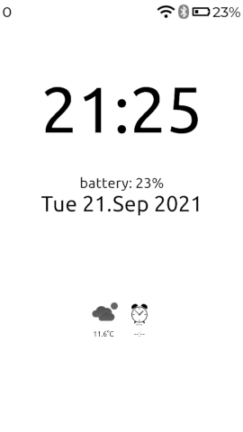
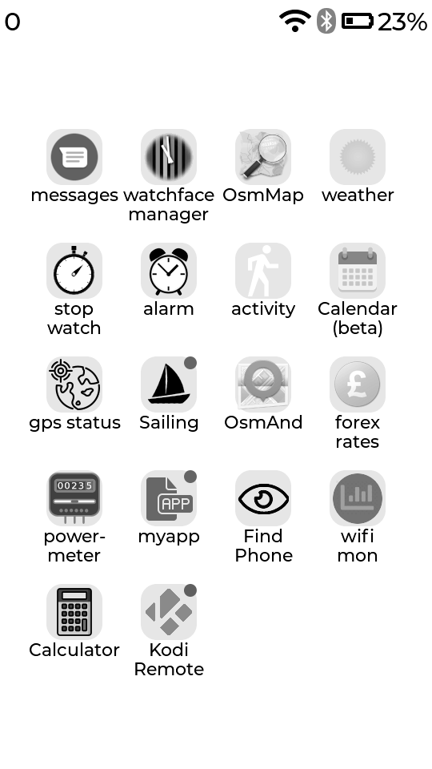
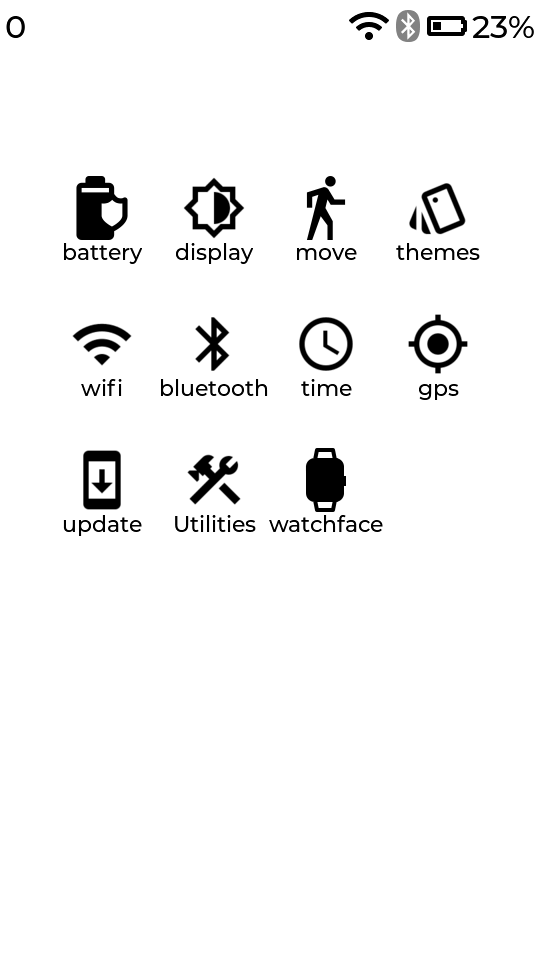
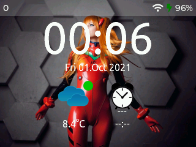
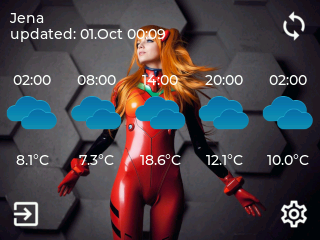
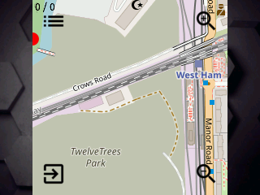
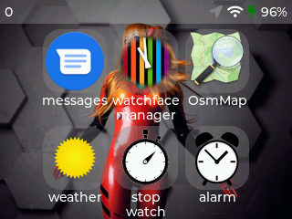
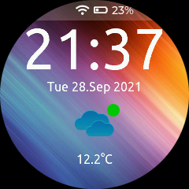
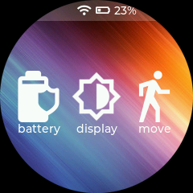
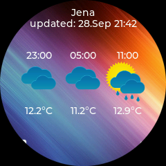

<p align="center">

&nbsp;

&nbsp;
<a href="https://www.buymeacoffee.com/sharandac" target="_blank"></a>
</p>
<hr/>

# My-TTGO-Watch

A GUI named hedge for smartwatch like devices based on ESP32. Currently support for T-Watch2020 (V1,V2,V3), T-Watch2021, M5Paper, M5Core2 and native Linux support for testing.

## Features

* BLE communication
* Time synchronization via BLE
* Notification via BLE
* Step counting
* Wake-up on wrist rotation
* Quick actions:

  * WiFi
  * Bluetooth
  * GPS
  * Luminosity
  * Sound volume

* Multiple watch faces:

  * Embedded (digital)
  * [Community based watchfaces](https://sharandac.github.io/My-TTGO-Watchfaces/)

* Multiple 'apps':

  * Music (control the playback of the music on your phone)
  * Navigation (displays navigation instructions coming from the companion app)
  * Map (displays a map)
  * Notification (displays the last notification received)
  * Stopwatch (with all the necessary functions such as play, pause, stop)
  * Alarm
  * Step counter (displays the number of steps and daily objective)
  * Weather
  * Calendar
  * IR remote
  * ...

* Companion apps: Gadgetbridge

## Install

Clone this repository and open it with platformIO. Select the right env and then build and upload.
Or follow the great step by step [tutorial](https://www.youtube.com/watch?v=wUGADCnerCs) from [ShotokuTech](https://github.com/ShotokuTech).
If you are interested in native Linux support, please install sdl2, curl and mosquitto dev lib and change the env to emulator_* in platformIO.

```bash
sudo apt-get install libsdl2-dev libcurl4-gnutls-dev libmosquitto-dev build-essential
```

# known issues

* the webserver crashes the ESP32 really often
* the battery indicator is not accurate, rather a problem with the power management unit ( axp202 )

# how to use

Cf. [Usage](USAGE.md)

# Forks that are recommended

[Pickelhaupt](https://github.com/Pickelhaupt/EUC-Dash-ESP32)<br>
[FantasyFactory](https://github.com/FantasyFactory/My-TTGO-Watch)<br>
[NorthernDIY](https://github.com/NorthernDIY/My-TTGO-Watch)<br>
[linuxthor](https://github.com/linuxthor/Hackers-TTGO-Watch)<br>
[d03n3rfr1tz3](https://github.com/d03n3rfr1tz3/TTGO.T-Watch.2020)<br>

# for the programmers

Cf. [contribution guide](CONTRIBUTING.md)

# Interface

## TTGO T-Watch 2020


## M5Paper ( downscaled )





## M5Core2 ( experimental )






## TTGO T-Watch 2021 ( experimental )





# Contributors

Special thanks to the following people for their help:

[5tormChild](https://github.com/5tormChild)<br>
[bwagstaff](https://github.com/bwagstaff)<br>
[chrismcna](https://github.com/chrismcna)<br>
[datacute](https://github.com/datacute)<br>
[fliuzzi02](https://github.com/fliuzzi02)<br>
[guyou](https://github.com/guyou)<br>
[jakub-vesely](https://github.com/jakub-vesely)<br>
[joshvito](https://github.com/joshvito)<br>
[JoanMCD](https://github.com/JoanMCD)<br>
[NorthernDIY](https://github.com/NorthernDIY)<br>
[Neuroplant](https://github.com/Neuroplant)<br>
[rnisthal](https://github.com/rnisthal)<br>
[paulstueber](https://github.com/paulstueber)<br>
[ssspeq](https://github.com/ssspeq)<br>

and the following projects:

[ArduinoJson](https://github.com/bblanchon/ArduinoJson)<br>
[AsyncTCP](https://github.com/me-no-dev/AsyncTCP)<br>
[ESP32SSDP](https://github.com/luc-github/ESP32SSDP)<br>
[ESP32-targz](https://github.com/tobozo/ESP32-targz)<br>
[ESP8266Audio](https://github.com/earlephilhower/ESP8266Audio)<br>
[ESPAsyncWebServer](https://github.com/me-no-dev/ESPAsyncWebServer)<br>
[LVGL](https://github.com/lvgl)<br>
[pubsubclient](https://github.com/knolleary/pubsubclient)<br>
[TFT_eSPI](https://github.com/Bodmer/TFT_eSPI)<br>
[TTGO_TWatch_Library](https://github.com/Xinyuan-LilyGO/TTGO_TWatch_Library)<br>

Every Contribution to this repository is highly welcome! Don't fear to create pull requests which enhance or fix the project, you are going to help everybody.
<p>
If you want to donate to the author then you can buy me a coffee.
<br/><br/>
<a href="https://www.buymeacoffee.com/sharandac" target="_blank"></a>
</p>
