# Main screen

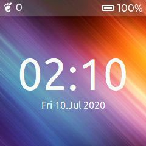

On startup you see the main screen (time tile). It shows the time and widgets.

Widgets are:

* the current weather (if correctly configured).
* the next alarm.
* the notifications.

# Screen Navigation

 You can swipe with you fingers up, down, left and right between the four main screens. The four screens are organized in time, apps, note and setup tile.

# Quick Settings


A subset of settings can be accessed via a swipe from the top of the screen.

# Settings

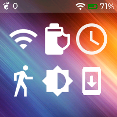
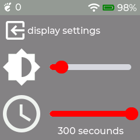

Once a setting is selected, you can leave the form with the exit button.

## Battery

Battery status.

## Display

Set color, background, touch feedback with vibrations...

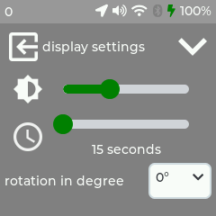
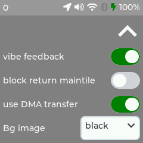

## Touch

Touch calibration menu.

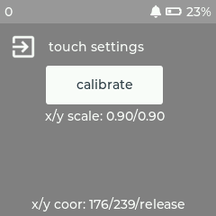
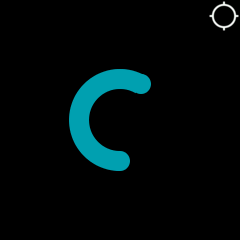

## Move

Enable:

* step counter
* double click
* tilt
* display of step counter

The stepcounter value is published to [gadgetbridge](https://gadgetbridge.org) automatically if bluetooth is enabled.
The frequency of publication is driven by gadgetbridge.
Initially, it is on a 30 minutes frequency.
When the realtime tab of gadgetbridge is selected, the frequency is set to every 5 seconds.
If the watch lost contact with gadgetbridge for more than 30 minutes, the stepcounter is also refreshed when bluetooth is reconnected.

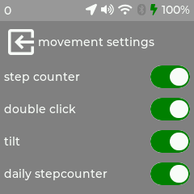

## Bluetooth

The bluetooth notification work with [gadgetbridge](https://gadgetbridge.org) very well. But keep in mind, bluetooth in standby reduces the battery runtime.

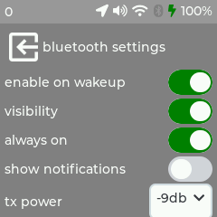

## WiFi

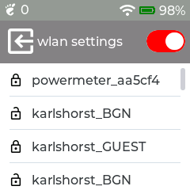

## Time

* Enable synchronisation when connect
* Display 12/24 hours
* Select region and location

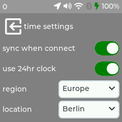

## Updates

It is possible to update over the air.

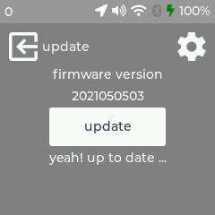
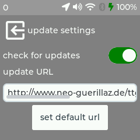

## Utilities

* Format
* Reboot
* Poweroff
* GPS injection

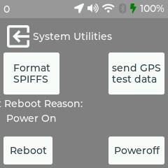

## Sound 

* Enable sound
* Set volume

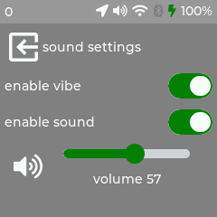

## GPS

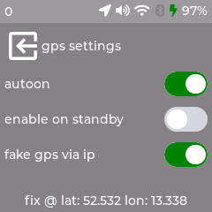

## Watchfaces

If you want to customize your own watchface, copy a  to your watch and decompress it with the watchface app.

A `watchface.tar.gz` includes the following files and a extra `watchface_theme.json`. Some example:

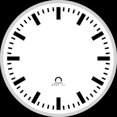


In the file `watchface_theme.json` you will describe the position of information via the `label` or 'image' node. See Cf. [here](WATCHFACE.md) for a node list.
Here you can find some finish watchface packages:

[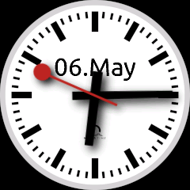](images/watchface/swiss/watchface.tar.gz)
[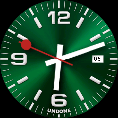](images/watchface/undone/watchface.tar.gz)
[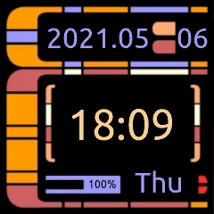](images/watchface/startrek/watchface.tar.gz)
[](images/watchface/rainbow/watchface.tar.gz)
[](images/watchface/hal9000/watchface.tar.gz)
[](images/watchface/black/watchface.tar.gz)

alternative [watchfaces](https://github.com/PGNetHun/PG-TTGO-Watchfaces)

# Applications

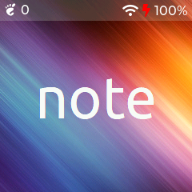

## weather app

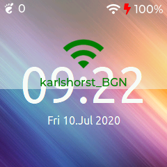

For the weather app you need an openweather.com api-id. http://openweathermap.org/appid is a good starting point.

## Stopwatch


Click play to start.

## Alarm

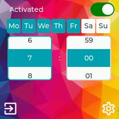

You can set an alarm, by setting time and day(s) of the week.

The main switch controls if alarm is enabled or not.

Next, select the day(s) of the week for the alarm.
Note that if no days are select, it means an every day alarm.
Finally, select the hour and minute for the alarm.

In the settings, you can select the reminder: vibe, fade, beep.
You can also have the next alarm displayed on the main face.

## ir-remote

For customise your ir-codes, use [WConfigurator](https://github.com/anakod/WConfigurator). For an example ir-remote.json configuration file see [here](https://github.com/d03n3rfr1tz3/TTGO.T-Watch.2020/blob/master/conf/ir-remote.json.example).

```json
{
    "pages": [{
            "Power": {
                "m": 7,
                "hex": "E0E040BF"
            },
            .
            .
            .
            "Stop": {
                "m": 7,
                "hex": "E0E0629D"
            }
        }
    ],
    "defBtnHeight": 33,
    "defBtnWidth": 65,
    "defSpacing": 2
}
```

IR-modes supported:

RC5 = 1, 
RC6 = 2,
NEC = 3,
SONY = 4,
PANASONIC = 5,
JVC = 6,
SAMSUNG = 7,
LG = 10,
SHARP = 14,
RAW = 30,
SAMSUNG36 = 56

IR-data format supported:

raw,
hex

## watchface

This application let you download community based watch faces.
Browse watch face with left/right button.
Clic on the icon when you find yours.

Here you can find an overview of all [watchfaces](https://sharandac.github.io/My-TTGO-Watchfaces/) on github.

Note that the information are downloaded in real time (remember to activate WiFi):

* The list of watchfaces.
* The preview of each watch.

## OSMmap

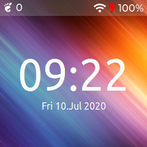
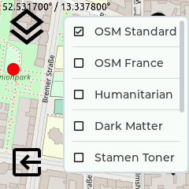
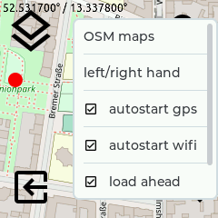


A long press in the middle centers the map to the current gps position.

## OSMAnd


In connection with [OsmAnd](https://osmand.net) the watch can also be used for navigation. Please use the osmand app, otherwise a lot of messages will be displayed.

## gps tracker

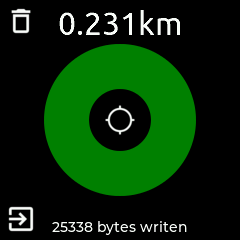
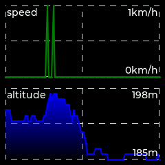

gps tracker that generates .gpx files. Only works properly with watches that have GPS. A long press on the crosshairs starts and stops the logging. The .gpx files can be downloaded via FTP and imported directly into e.g. GoogleMaps or OSM. The trash icon deletes all files to save space.

## gps status

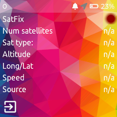

## astro

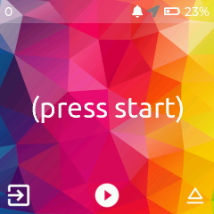

## powermeter

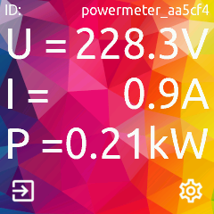

Get realtime data from a [powermeter](https://github.com/sharandac/powermeter) over mqtt.

## wfif mon

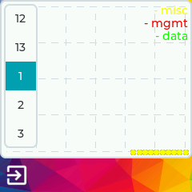

## Activity tracker

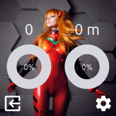

The activity tracker let you check your activity.

In the settings, set your step length and your goals in step and meters.

When associated to Gadgetbrige, activity is reported regularly.
If you need to ensure a synchronization, for example at the beginning of an activity or at the end, you can use the refresh button.
It will force a synchronization.

The trash can button allows to reset step counter.
Useful when starting a new activity an keeping exact track of it.

## Sailing

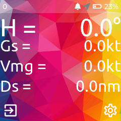

This app connects to your [OpenPlotter](https://openmarine.net/openplotter) and shows some of your boat stats.

In order to make it work you have to configure your OpenCPN plotter in the connections tab as follows:

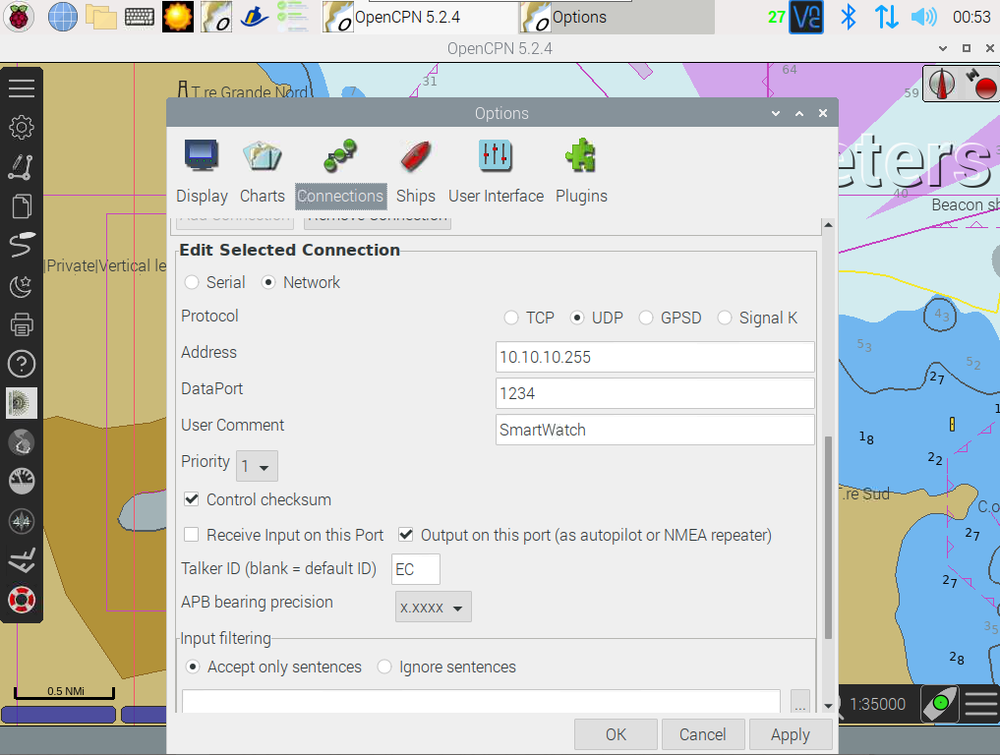

Set "Output filtering" to trasmit the sentences: RMB,RMC,APB

Contact [fliuzzi02](https://github.com/fliuzzi02) for further info and help.
Some improvements might come in the future.

## Kodi Remote

A remote for controlling Kodi. Includes a player tile and a tile for a remote control.

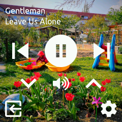
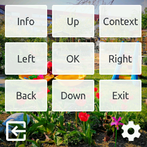

## Calc

A simple calculator.
Beware that the button C/CE has two functions. A short touch uses CE, which clears only the
recent input. A longer touch uses C, which clears all inputs and basically resets the calculator.

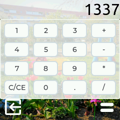

# Updates

See `Updates` in settings.

# FAQ

## how to make a screenshot?

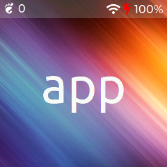

Press the button for 2 seconds, after that an quickmenu appears. Here you can select the tiny camera icon to take a screenshot.
This can be downloaded via the built-in FTP server (binary and passive mode, username: TTWatch and password: passord), if activated.
The file name is screen.png.

Or the other way:

The firmware has an integrated webserver. Over this a screenshot can be triggered. The image store as png and can be read with gimp. From bash it look like this
```bash
wget x.x.x.x/shot ; wget x.x.x.x/screen.png
```

Pro-tipp:

[lgrossard](https://github.com/lgrossard)! made a little Python script to generate and download the screenshots from the t-watch [here](https://ludovic.grossard.fr/media/twatch_screenshot.py).

## how to change background?

You can change background in the display settings.

If you want to use your own background image, simply upload a PNG with a resolution of 240x240 pixels via ftp to the Watch and name it bg.png and set it in the display settings page 2.
